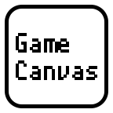

# GameCanvas にようこそ

GameCanvas for Unity は、慶應義塾大学の講義「スマートデバイスプログラミング」で使う 2Dゲームの枠組みです。学生が触るのは主に `Assets/Game.cs` です。

Unity の版は 6000.6.2f1 に固定しています。教材は [Packages/jp.ac.keio.sfc.sdp/Documentation~/jp.ac.keio.sfc.sdp.md](Packages/jp.ac.keio.sfc.sdp/Documentation~/jp.ac.keio.sfc.sdp.md) から読んでください。関数の一覧は機械生成の [API ドキュメント](https://sfc-sdp.github.io/GameCanvas-Unity/) にあります。入口の有無はソース `Packages/jp.ac.keio.sfc.sdp/Runtime/Scripts` が正です。

## 導入

1. [Unity Hub](https://unity3d.com/jp/get-unity/download) を入れ、Unity 6000.6.2f1 を選びます。実機へ出す予定があるなら、Android Build Support（SDK & NDK Tools と OpenJDK を含む）、iOS Build Support、日本語言語パックも付けます。
2. [最新の GameCanvas](https://github.com/sfc-sdp/GameCanvas-Unity/releases/latest) からソースを入手して解凍するか、このリポジトリを開きます。Unity Hub の「リストに追加」からフォルダを登録します。
3. プロジェクトを開き、`Assets/Game.unity` を表示した状態で再生ボタンを押します。青空の画像と日本語、右上の秒数が出れば、エディタ側の準備は足りています。
4. [Assets/Game.cs](Assets/Game.cs) を編集します。

Windows での導入は、このリポジトリでは確認していません。Android 実機ではポインターとキーの押下・解放を確認しています。iOSシミュレータではタップ、ドラッグ、ホームへ移ったあとの復帰と、そのあとの新しいドラッグ、日本語表示を確認しています。iOSの複数指と、接触中のキャンセルは未確認です。

実機への書き出しは、メニューの `GameCanvas/アプリをビルドする` と、[講義テキスト](https://github.com/sfc-sdp/SDP-Textbook) を見てください。

## 質問・バグ報告

質問や提案、バグ報告は [Issues](https://github.com/sfc-sdp/GameCanvas-Unity/issues) で受け付けています。

## ライセンス

Copyright (c) 2015-2026 Smart Device Programming.

This software is released under the MIT License, see [LICENSE](LICENSE).
